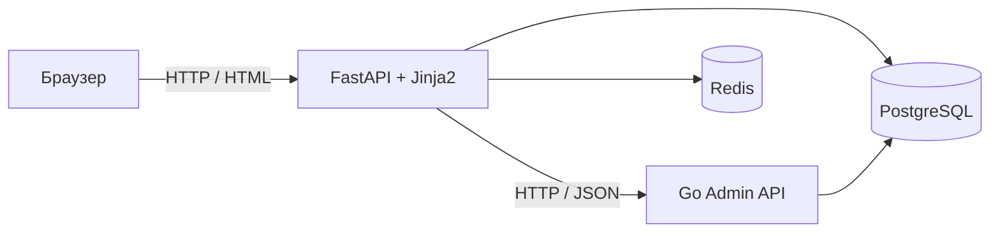

# MedHub

MedHub — веб-приложение для публикации и обсуждения статей, в том числе медицинской тематики. Пользовательская часть работает на **Python / FastAPI**, а отдельный сервис администрирования — на **Go**.

Личный проект в активной разработке. В репозитории реализованы пользовательские сценарии, административный интерфейс, работа с PostgreSQL и Redis, тесты Python-приложения и локальное окружение Docker Compose.

## Возможности

- Регистрация и вход, профили авторов и подписки.
- Создание, редактирование и удаление статей; поиск по заголовку и фильтрация по категориям.
- Комментарии, реакции like/dislike и список понравившихся статей.
- Проверка прав автора при изменении статей и удалении комментариев.
- Мягкое удаление пользовательского профиля.
- Административный интерфейс: поиск и удаление пользователей, статей и комментариев, статистика пользователей и публикаций за выбранную дату.

### Бизнес-правила и хранение данных

- Перед публикацией проверяется лимит: менее трёх уже созданных статей за текущую дату у автора. Проверка находится в `LogicRepository.can_publish_today`; это прикладная проверка, отдельной защиты лимита от одновременных запросов пока нет.
- Для пары `(user_id, article_id)` допускается **одна реакция за всё время**. Повторная реакция отклоняется; ежедневного сброса и смены реакции сейчас нет.
- Уникальность реакции обеспечивается ограничением PostgreSQL `uq_reactions_user_article`. Запись реакции и увеличение счётчика статьи выполняются в одной транзакции; при повторной реакции транзакция откатывается.
- Статьи и пользователи кешируются в Redis с TTL 1 час. При промахе кеша или ошибке подключения чтение обращается к PostgreSQL. Пользовательские операции изменения обновляют или удаляют соответствующие записи кеша.

## Архитектура



Оба приложения используют общую базу `medhub`. Схемой БД управляют миграции Alembic из Python-приложения. Административные HTML-страницы обслуживает FastAPI, запрашивая данные у Go-сервиса.

```text
medhub/
├── fastapi-app/
│   ├── app/presentation/      # HTTP-обработчики, шаблоны, зависимости
│   ├── app/application/       # Сервисы, DTO, сценарии приложения
│   ├── app/domain/            # Сущности, интерфейсы, исключения
│   ├── app/infrastructure/    # PostgreSQL, Redis, конфигурация
│   ├── alembic/              # Миграции общей базы
│   ├── tests/                # Тесты сервисов, репозиториев и обработчиков
│   └── docker-compose.yml
└── admin-services/
    ├── cmd/                  # Точка входа Go-сервиса
    └── internal/
        ├── handler/          # HTTP-обработчики
        ├── service/          # Прикладная логика и аутентификация
        ├── domain/           # Модели, фильтры, ошибки
        ├── storage/postgres/ # SQL-запросы и пул соединений
        └── config/           # Конфигурация из окружения
```

## Стек

| Компонент | Технологии |
| --- | --- |
| Пользовательское приложение | Python 3.11+, FastAPI, Pydantic, Jinja2, Uvicorn |
| Доступ к данным Python | PostgreSQL, SQLAlchemy Async, asyncpg, Alembic |
| Кеш | Redis, асинхронный клиент redis-py |
| Административный сервис | Go 1.26.2, net/http, pgx/pgxpool, context, log/slog |
| Аутентификация | JWT; Argon2 для пользователей, bcrypt для администраторов |
| Тесты и инструменты | pytest, pytest-asyncio, httpx, pytest-cov, Ruff |
| Локальное окружение | Docker Compose, PostgreSQL 15, Redis 8.6.1 |

В Docker Python-приложение использует Python 3.13. Версии зависимостей находятся в [pyproject.toml](fastapi-app/pyproject.toml), [requirements.txt](fastapi-app/requirements.txt) и [go.mod](admin-services/go.mod).

## Быстрый запуск через Docker Compose

Понадобятся Docker Engine / Docker Desktop и Docker Compose v2. Команды ниже выполняются из корня репозитория.

### 1. Подготовить конфигурацию

Windows PowerShell:

```powershell
cd fastapi-app
Copy-Item .env.example .env
```

Linux / macOS:

```bash
cd fastapi-app
cp .env.example .env
```

Перед копированием убедитесь, что `.env` ещё не создан: существующий файл нужно отредактировать, сохранив свои настройки.

В `.env` задайте собственные значения `SECRET_KEY`, `SECRET_KEY_MIDDLEWARE` и `POSTGRES_PASSWORD`. Обновите пароль и в строках подключения `ADMIN_DB_URL`, `PROD_DB_URL`, `TEST_DB_URL`. Значения из шаблона служат примерами.

Оставьте `POSTGRES_DB=postgres`: [init.sql](fastapi-app/init.sql) отдельно создаёт базу `medhub` при первой инициализации PostgreSQL. Compose подставляет адреса контейнеров для подключения приложения к БД, Redis и Go-сервису; локальные адреса в `.env` используются при запуске без контейнера.

### 2. Собрать и запустить

Из каталога `fastapi-app`:

```bash
docker compose up --build -d
docker compose ps
docker compose logs --tail=100 app admin
```

PostgreSQL и Redis имеют healthcheck. При старте Python-приложения выполняется `alembic upgrade head`, затем запускается Uvicorn.

| Адрес | Назначение |
| --- | --- |
| [localhost:8000](http://localhost:8000) | Лента статей |
| [localhost:8000/docs](http://localhost:8000/docs) | OpenAPI Python-приложения; многие пользовательские маршруты возвращают HTML |
| [localhost:8000/admin/login](http://localhost:8000/admin/login) | Вход в административный интерфейс |
| [localhost:8001](http://localhost:8001) | Go Admin API, маршруты начинаются с `/admin` |

Администратор не создаётся автоматически. Инструкция находится в [README Go-сервиса](admin-services/README.md).

### 3. Остановить окружение

```bash
docker compose down
```

Данные PostgreSQL сохраняются в именованном томе. `init.sql` выполняется только при создании нового хранилища: если используется старый том без базы `medhub`, её необходимо создать отдельно. Тестовая база `testmedhub` автоматически не создаётся.

## Разработка и тестирование

- [Python-приложение: локальный запуск, конфигурация, маршруты и тесты](fastapi-app/README.md).
- [Go-сервис: локальный запуск, административный API и создание администратора](admin-services/README.md).

Python-тесты охватывают сервисы, SQL- и Redis-репозитории, HTTP-обработчики, права владельца, валидацию и повторные реакции. Интеграционные тесты требуют отдельной тестовой БД и отдельного экземпляра Redis: текущие фикстуры удаляют таблицы тестовой базы и выполняют Redis `FLUSHALL`.

## Текущее состояние и ограничения

- Окружение предназначено для локальной разработки. Go проверяет JWT через `/admin/me`, а FastAPI использует эту проверку для административных страниц. Прямая проверка токена на каждом маршруте Go API ещё не подключена; порт 8001 нельзя открывать недоверенным клиентам. По умолчанию Compose публикует его на всех интерфейсах хоста.
- Счётчики просмотров накапливаются в Redis. Фоновая задача APScheduler запускается каждые 12 часов, но перенос просмотров в PostgreSQL пока не реализован.
- Изменения через Go-сервис пока не инвалидируют кеш Python-приложения, поэтому административное удаление может оставлять устаревшие данные в Redis до истечения TTL.
- Автоматические тесты Go-сервиса ещё не добавлены.
