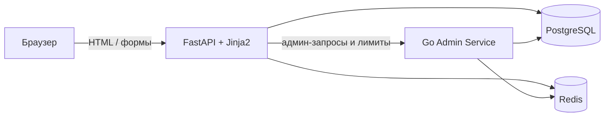

# MedHub

MedHub — веб-платформа для публикации и обсуждения тематических статей. Пользовательская часть построена на **FastAPI**, а административные операции, статистика и лимитирование вынесены в отдельный сервис на **Go**. Оба приложения используют PostgreSQL; Redis применяется для кеширования и лимитов публикаций.

Проект показывает работу с многосервисной архитектурой, асинхронным Python, нативным HTTP-сервером Go, общей реляционной моделью, кешем, JWT/CSRF-защитой и интеграционными тестами.

## Что реализовано

### Пользовательская часть

- Регистрация и вход, JWT в HttpOnly cookie, профили авторов.
- Создание, просмотр, редактирование и удаление собственных статей.
- Поиск статей по заголовку и фильтрация по категории.
- Комментарии с проверкой владельца при удалении.
- Реакции `like`/`dislike` и список понравившихся статей.
- Подписки и отписки от авторов.
- Мягкое удаление профиля.
- Redis-кеш статей и пользователей с переходом к PostgreSQL при промахе или недоступности Redis.
- CSRF-проверка изменяющих HTML-форм.

### Администрирование

- Отдельная учётная запись администратора и JWT-аутентификация.
- Защита административных Go-маршрутов middleware `RequireAdmin`.
- Поиск и удаление пользователей, статей и комментариев.
- Комбинируемые фильтры статей: ID статьи, ID пользователя, часть заголовка и дата публикации.
- Фильтрация комментариев по статье, пользователю и дате.
- Переход из административного списка непосредственно на страницу статьи.
- Статистика за выбранный диапазон: количество пользователей и статей, три наиболее популярные категории и три наиболее активных автора.
- Частичный ответ статистики: ошибка одного независимого запроса не блокирует остальные показатели.

### Ограничения публикаций и целостность данных

- Не более трёх статей от пользователя за календарный день.
- Не более десяти комментариев пользователя к одной статье за час.
- Основной быстрый путь лимитирования реализован в Go через атомарный `INCR` Redis; Python выполняет SQL-проверку через `LogicRepository`, если сервис лимитов недоступен или вернул неожиданный ответ.
- Для пары `(user_id, article_id)` разрешена одна реакция за всё время. Ограничение `uq_reactions_user_article` контролируется PostgreSQL.
- Добавление реакции и изменение счётчика статьи выполняются в одной транзакции; конфликт откатывает изменение.

## Архитектура


```mermaid
flowchart LR
    Browser[Браузер] -->|HTML / формы| FastAPI[FastAPI + Jinja2]
    FastAPI -->|админ-запросы и лимиты| Go[Go Admin Service]
    FastAPI --> PostgreSQL[(PostgreSQL)]
    FastAPI --> Redis[(Redis)]
    Go --> PostgreSQL
    Go --> Redis
```

- **FastAPI** отвечает за пользовательские сценарии, HTML-интерфейс и проксирование административных запросов.
- **Go Admin Service** предоставляет JSON API, проверяет административные JWT, выполняет SQL-запросы статистики и обслуживает Redis-лимитеры.
- **PostgreSQL** является общим источником данных. Схемой управляют миграции Alembic из Python-приложения.
- **Redis** хранит кеш пользователей и статей и ключи лимитеров.

Оба приложения разделены на слои представления, прикладной логики, домена и инфраструктуры:

```text
medhub/
├── fastapi-app/
│   ├── app/presentation/      # FastAPI endpoints, зависимости, Jinja2, CSS/JS
│   ├── app/application/       # сервисы и DTO
│   ├── app/domain/            # сущности, интерфейсы, исключения
│   ├── app/infrastructure/    # SQLAlchemy, PostgreSQL, Redis, конфигурация
│   ├── alembic/               # миграции общей базы
│   ├── tests/                 # сервисные, repository- и endpoint-тесты
│   └── docker-compose.yml
└── admin-services/
    ├── cmd/                   # точка входа Go-сервиса
    └── internal/
        ├── handler/           # HTTP, JWT middleware, JSON-ответы
        ├── service/           # аутентификация, статистика, лимитеры
        ├── domain/            # модели, фильтры, ошибки
        ├── storage/postgres/  # pgx/pgxpool и параметризованный SQL
        ├── storage/redis/     # счётчики лимитов
        └── config/            # конфигурация окружения
```

## Стек

| Область | Технологии |
| --- | --- |
| Backend | Python 3.11+/3.13, FastAPI, Go 1.26.2, `net/http` |
| Работа с данными | PostgreSQL 15, SQLAlchemy Async, asyncpg, pgx/pgxpool, Alembic |
| Кеш и лимитирование | Redis, redis-py, go-redis |
| Интерфейс | Jinja2, HTML, CSS, JavaScript |
| Безопасность | JWT HS256, Argon2, bcrypt, HttpOnly cookies, CSRF-токены |
| Тестирование | pytest, pytest-asyncio, httpx, Go `testing` |
| Качество кода | Ruff, `gofmt`, `go vet`, структурированные логи `logging`/`slog` |
| Окружение | Docker Compose, healthcheck PostgreSQL и Redis |

Точные версии находятся в [pyproject.toml](fastapi-app/pyproject.toml), [requirements.txt](fastapi-app/requirements.txt) и [go.mod](admin-services/go.mod).

## Быстрый запуск

Понадобятся Docker Desktop или Docker Engine с Compose v2.

### 1. Настроить окружение

Windows PowerShell:

```powershell
cd fastapi-app
Copy-Item .env.example .env
```

Linux / macOS:

```bash
cd fastapi-app
cp .env.example .env
```

В `.env` замените демонстрационные значения `SECRET_KEY`, `SECRET_KEY_MIDDLEWARE`, `SECRET_KEY_GO` и `POSTGRES_PASSWORD`, затем обновите пароль в строках подключения. Оставьте `POSTGRES_DB=postgres`: [init.sql](fastapi-app/init.sql) создаёт прикладную базу `medhub` при первой инициализации нового тома.

### 2. Запустить сервисы

Из каталога `fastapi-app`:

```bash
docker compose up --build -d
docker compose ps
docker compose logs --tail=100 app admin
```

Перед запуском Uvicorn контейнер Python применяет `alembic upgrade head`.

| Адрес | Назначение |
| --- | --- |
| [localhost:8000](http://localhost:8000) | Пользовательская лента |
| [localhost:8000/docs](http://localhost:8000/docs) | OpenAPI FastAPI |
| [localhost:8000/admin/login](http://localhost:8000/admin/login) | Вход в административный интерфейс |
| [localhost:8001](http://localhost:8001) | Внутренний Go API |

Администратор автоматически не создаётся. Команды регистрации приведены в [README Go-сервиса](admin-services/README.md#создание-локального-администратора).

### 3. Остановить окружение

```bash
docker compose down
```

Именованный том PostgreSQL сохраняется. `init.sql` повторно не запускается для уже существующего тома.

## Проверки

Python, из `fastapi-app`:

```bash
pytest
ruff check .
ruff format --check .
```

Go, из `admin-services`:

```bash
go test ./...
go vet ./...
```

Repository-тесты используют реальные PostgreSQL и Redis. Они должны быть направлены на отдельные тестовые экземпляры: Python-фикстуры очищают тестовые таблицы и вызывают Redis `FLUSHALL`, а Go PostgreSQL-тесты выполняют `TRUNCATE`.

Подробные инструкции:

- [Python-приложение](fastapi-app/README.md)
- [Go Admin Service](admin-services/README.md)

## Текущее состояние и ограничения

- Go Redis-клиент использует жёстко заданный адрес `redis:6379`. Он подходит для Compose, но для запуска Go-сервиса на хосте адрес придётся изменить или вынести в окружение.
- Административное удаление выполняется напрямую в PostgreSQL и не инвалидирует Redis-кеш Python-приложения.
